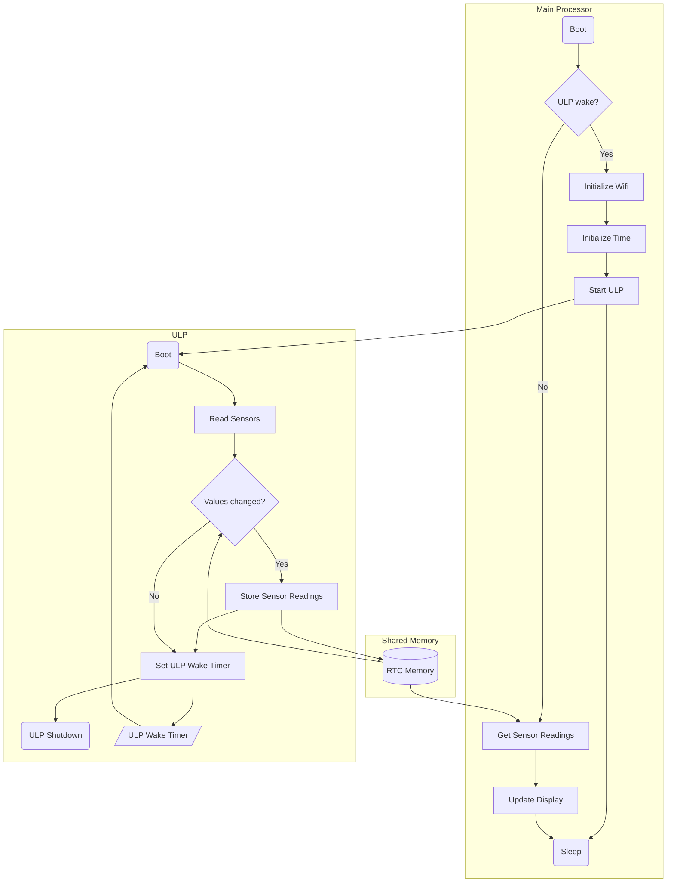

# Mayfly

> Low-power IOT Environmental Monitoring with CircuitPython and the ESP32-S2 RISC-V ULP

This project collects various sensor readings, shows them on an e-paper display, and records to ThingSpeak. It's intended to be used in aquaculture and hydroponics, but it could be used for any application where you want to monitor, display, and record values with a battery-powered device.

## Hardware

- [UnexpectedMaker FeatherS2][feathers2]
- [Adafruit Liquid Level Sensor][liquid-level-sensor]
- [Atlas Scientific Gravity Analog pH Kit][ph-kit]
- [Atlas Scientific Gravity Analog Dissolved Oxygen Kit][do-kit]
- [DS18B20 Temperature Sensor][ds18b20]

[feathers2]: https://feathers2.io/
[liquid-level-sensor]: https://www.adafruit.com/product/1786
[ph-kit]: https://atlas-scientific.com/kits/gravity-analog-ph-kit/
[do-kit]: https://atlas-scientific.com/kits/gravity-analog-do-kit/
[ds18b20]: https://www.digikey.com/en/datasheets/maxim-integrated/maxim-integrated-ds18b20
